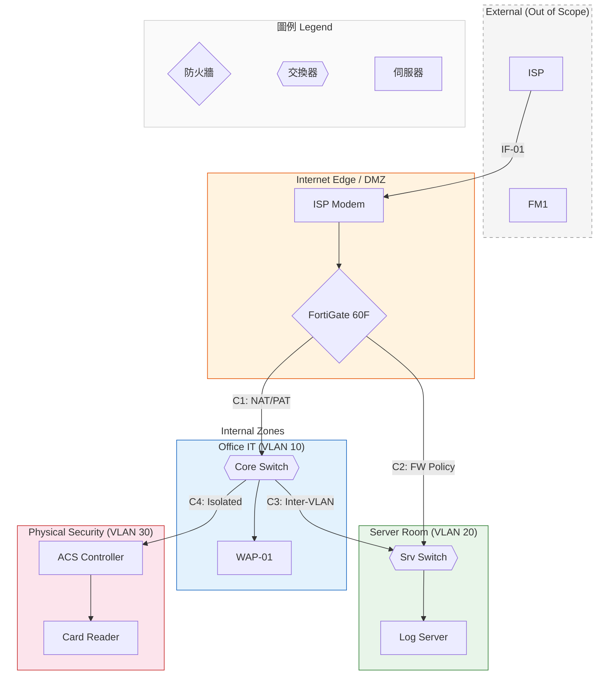

# 架構圖渲染規範

本 Skill 定義系統架構圖的生成工具選擇、圖層佈局、視覺樣式與輸出格式，確保每次產出一致的圖面品質。適用於資安、網路、IT/OT 基礎設施、實體安全等系統整合專案。

---

## 1. 工具優先順序

| 優先級 | 工具 | 適用場景 | 輸出格式 |
|--------|------|----------|----------|
| 1（預設） | D2 | 正式交付、需要高品質版面控制時 | `.d2` 原始碼 + `d2 → .svg` |
| 2（回退） | Mermaid | D2 CLI 不可用時，或需要即時預覽時 | 嵌入 markdown ` ```mermaid ` |
| 3（雙軌） | D2 + Mermaid 並行 | 同時需要正式圖和即時預覽時（**建議預設採用此模式**） |

**決策規則**：
- 若使用者選擇 D2，**一律同時產出 Mermaid 等效圖**作為即時預覽（因 D2 CLI 可能不在環境中）
- 若使用者未指定工具，預設採用雙軌模式
- 若明確只要 Mermaid，則不產出 D2 原始碼

---

## 2. 圖層佈局規則

架構圖採 **Top-to-Bottom (TB)** 方向，由外到內分層：

```
Layer 0: External Systems（範疇外）    ← 灰色虛線框
  ↓
Layer 1: Internet Edge / DMZ           ← 橘色邊框
  ↓
Layer 2: Internal Zones（並排）        ← 各 Zone 獨立色塊
  ├── Office IT Zone
  ├── Server Room Zone
  ├── OT/ICS Zone（如適用）
  └── Physical Security Zone
  ↓
Layer 3: Conduit 連線                  ← Zone 之間的連接線
```

**Zone 排列原則**：
- 依安全等級由左至右遞增（低 SL → 高 SL）
- 相同安全等級的 Zone 水平並排
- Zone 之間保持足夠間距，不重疊
- External Systems 放最上方，與 DMZ 之間用虛線連接

---

## 3. 顏色規範

| 元素類型 | D2 樣式 | Mermaid 對應 | 用途 |
|----------|---------|-------------|------|
| External (Out of Scope) | `style.fill: "#f5f5f5"` `style.stroke: "#999"` `style.stroke-dash: 5` | `style fill:#f5f5f5,stroke:#999,stroke-dasharray: 5 5` | 灰底虛線，表示不在我方範疇 |
| Internet Edge / DMZ | `style.fill: "#fff3e0"` `style.stroke: "#e65100"` | `style fill:#fff3e0,stroke:#e65100` | 橘底，高風險邊界警示色 |
| Office IT Zone | `style.fill: "#e3f2fd"` `style.stroke: "#1565c0"` | `style fill:#e3f2fd,stroke:#1565c0` | 淺藍底，一般辦公 |
| Server Room Zone | `style.fill: "#e8f5e9"` `style.stroke: "#2e7d32"` | `style fill:#e8f5e9,stroke:#2e7d32` | 淺綠底，受保護伺服器區 |
| Physical Security Zone | `style.fill: "#fce4ec"` `style.stroke: "#c62828"` | `style fill:#fce4ec,stroke:#c62828` | 淺紅底，實體安全 |
| OT/ICS Zone | `style.fill: "#fff8e1"` `style.stroke: "#f57f17"` | `style fill:#fff8e1,stroke:#f57f17` | 淺黃底，工控區域 |
| Conduit — 正常流量 | `style.stroke: "#333"` 實線 `→` | `-->` 或 `==>` | 實線箭頭 |
| Conduit — 受限/加密 | `style.stroke: "#333"` 虛線 `→` | `-.->` | 虛線箭頭，表示受限或加密 |
| 防火牆 / 安全設備 | 菱形 `{ }` 符號 | `{"設備名"}` | 與一般設備區分 |
| 交換器 | 六角形 `{{ }}` | `{{"設備名"}}` | 網路設備識別 |

**擴充 Zone 顏色**：若專案有上述未列出的 Zone 類型，從 Material Design 色票中選擇淺色系（50-100 級），保持與現有 Zone 的視覺區分度。

---

## 4. 元件命名慣例

| 類別 | 命名模式 | 範例 |
|------|----------|------|
| 防火牆 | `{品牌} {型號}` | `FortiGate 60F` |
| 交換器 | `{品牌} {型號}` | `Cisco CBS350-24T` |
| 無線 AP | `WAP-{序號}` + `<br/>{位置描述}` | `WAP-01<br/>Office Area` |
| 伺服器角色 | `{功能名稱}<br/>Server` | `Log / Syslog<br/>Server` |
| 門禁設備 | `{設備類型}<br/>{部署描述}` | `Card Readers<br/>(Entry Points)` |
| 外部系統 | `{系統名稱}<br/>(備註)` | `FM1 Project<br/>(No Direct Link)` |
| OT 設備 | `{功能名稱}<br/>{品牌/型號}` | `PLC<br/>Siemens S7-1500` |

**Mermaid 節點 ID 規則**：
- 使用全大寫縮寫，底線分隔（如 `EDGE_FW`, `CORE_SW`, `SRV_SW`, `ACS`）
- 同類型多台設備用數字後綴（如 `AP1`, `AP2`, `AP3`）
- ID 必須與文件中的元件簡稱一致

---

## 5. Conduit 標註格式

Conduit 連線上的標籤格式為：`C{序號}: {安全機制簡述}`

範例：
- `C1: NAT/PAT`
- `C2: FW Policy`
- `C3: Inter-VLAN via FW`
- `C4: Isolated VLAN`
- `C5: Data Diode (單向)`

Conduit 編號從 C1 開始連續編號，不跳號。

---

## 6. D2 專用規範

### 6.1 基本語法

```d2
# 全域設定
direction: down

# Zone 容器使用 style 統一設定
zone_name: {
  label: "Zone: {名稱} (VLAN {ID})"
  style.fill: "{對應顏色}"
  style.stroke: "{對應邊框色}"
  style.border-radius: 8
  style.font-size: 16
}

# 元件使用 shape 區分
firewall: { shape: diamond }
switch: { shape: hexagon }
server: { shape: rectangle }
endpoint: { shape: rectangle; style.stroke-dash: 3 }
```

### 6.2 ⚠️ 跨容器連線規則（關鍵佈局規則）

D2 中，跨容器（Zone 間）連線**必須使用完整路徑名稱**，否則 layout engine 會將節點抽出容器，導致 Zone 視覺佈局扁平化、TB 排列失效。

**正確寫法**（完整路徑）：
```d2
EXT.ISP -> DMZ.MODEM: { label: "IF-01: WAN" }
DMZ.EDGE_FW -> OFFICE_IT.CORE_SW: { label: "C1: NAT/PAT" }
DMZ.EDGE_FW -> SERVER_ROOM.SRV_SW: { label: "C2: FW Policy" }
OFFICE_IT.CORE_SW -> SERVER_ROOM.SRV_SW: { label: "C3: Inter-VLAN via FW" }
OFFICE_IT.CORE_SW -> PHYSICAL_SEC.ACS: { label: "C4: Isolated VLAN" }
```

**錯誤寫法**（缺少容器前綴，layout 會走樣）：
```d2
# ❌ 以下寫法會導致 D2 layout engine 將節點從容器中抽出
ISP -> MODEM: { label: "IF-01: WAN" }
EDGE_FW -> CORE_SW: { label: "C1: NAT/PAT" }
```

### 6.3 Zone 巢狀結構與佈局

D2 的容器排列遵循定義順序。為確保 TB（Top-to-Bottom）佈局：

1. **先定義 External（最上方）**
2. **再定義 DMZ**
3. **再定義 Internal Zones（並排）** — 使用頂層 `grid-columns` 或依序定義
4. **最後定義 Legend（最下方）**

**Zone 間連線統一在所有容器定義之後集中寫**，不要散布在容器內部。

### 6.4 其他 D2 注意事項

- 容器（Zone）使用巢狀結構，不用 `subgraph`
- 連線標籤用 `label` 屬性
- 虛線用 `style.stroke-dash: 5`
- 檔名格式：`{project}_facility.d2`
- 每個容器內部的元件連線可在容器內定義（不跨容器）

---

## 7. 輸出檔案結構

| 檔案 | 路徑 | 說明 |
|------|------|------|
| D2 原始碼 | `{output_dir}/{project}_facility.d2` | 正式圖檔原始碼 |
| Mermaid 嵌入 | `{output_dir}/architecture.md` §2.1 | 即時預覽，嵌入 markdown |
| SVG 產出 | `{output_dir}/{project}_facility.svg` | D2 CLI 可用時自動產出 |

若為獨立使用（非 Presales 流程內），輸出至使用者指定的目錄。

---

## 7.5 Mermaid 佈局規範

### 7.5.1 ⚠️ subgraph 巢狀結構（確保 TB 排列）

Mermaid 的 `graph TB` 在有多個 subgraph 時，渲染器會根據連線方向自動排列，常導致水平展開。為強制 TB 佈局，使用以下策略：

1. **外部系統放最上層**，DMZ 緊接其下
2. **Internal Zones 用一個包裹 subgraph 並排** — 用 `direction LR` 讓 Zone 水平排列
3. **圖例放最底部**

**正確的巢狀結構**：


### 7.5.2 關鍵規則

| 規則 | 說明 |
|------|------|
| INTERNAL 包裹層 | 用 `direction LR` 讓 Office/Server/PhySec 水平排列，`fill:none,stroke:none` 隱藏外框 |
| Cross-zone 連線位置 | **所有跨 subgraph 的連線必須寫在所有 subgraph 定義之後** |
| style 位置 | **所有 style 語句必須寫在最後** |
| `~~~` 隱形連線 | 用於強制同層節點排列（如 EXT 內的多個外部系統） |
| LEGEND subgraph | **必須包含**，放在最底部，使用 `direction LR` |

### 7.5.3 ⚠️ 常見錯誤

- **❌** Internal Zones 沒有 INTERNAL 包裹層 → Mermaid 會各自獨立排列
- **✅** 用 `subgraph INTERNAL[""]` + `direction LR` 包裹所有 Internal Zones，再 `style INTERNAL fill:none,stroke:none`

---

## 8. 圖例區

**⚠️ 每張架構圖（D2 和 Mermaid）都必須包含圖例（Legend）。** 這是必要元素，不可省略。

圖例必須說明：
- 各 Zone 顏色代表的安全等級（含 SL 標記）
- 實線/虛線的差異（正常流量 vs 受限/加密）
- 菱形/六角形/矩形的設備類型對應
- `<br/>` 不在正式圖例文字中出現（僅 Mermaid 渲染用）

圖例格式範例（Mermaid）：
```
    subgraph LEGEND["圖例 Legend"]
        direction LR
        L_FW{"防火牆 Firewall"}
        L_SW{{"交換器 Switch"}}
        L_SRV["伺服器 Server"]
        L_LINE1["── 正常流量"]
        L_LINE2["-·- 受限/加密"]
    end
```

---

## 9. 架構文件結構（當作為獨立交付物時）

若此 Skill 被獨立觸發（非 Presales 流程），產出的 `architecture.md` 應包含：

```
§1 系統邊界（In/Out Scope + 外部介面表）
§2 邏輯架構圖（D2 + Mermaid + 元件說明表）
§3 Zone/Conduit（Zone 定義表 + Conduit 定義表）
§4 資料流表
§5 關鍵技術選型表
§6 圖例
```

**元件說明表必備欄位**：

```
| 元件 | 功能描述 | 部署位置 | 備註 |
```

**Zone 定義表必備欄位**：

```
| Zone | VLAN | 安全等級 | 包含元件 | 說明 |
```

安全等級使用 IEC 62443 SL 表示法：`SL-1 (Basic)`, `SL-2 (Managed)`, `SL-3 (Systemic)`, `SL-4 (High)`

**Conduit 定義表必備欄位**：

```
| Conduit | 連接 Zone | 通訊協定 | 安全措施 | 備註 |
```

---

## 10. 語言規範

| 元素 | 語言 | 範例 |
|------|------|------|
| 章節標題 | 中文 | `系統邊界`、`技術選型` |
| 表格欄位名 | 中文 | `元件`、`功能描述` |
| 技術術語 | 英文原文（不翻譯） | `Firewall`、`EDR`、`VLAN` |
| 品牌/型號 | 英文原文 | `FortiGate 60F`、`Cisco CBS350` |
| 縮寫首次出現 | 全稱 + 縮寫 | `端點偵測與回應 (EDR)` |
| Zone 標籤 | 英文（圖內）+ 中文（表格說明） | 圖：`Zone: Office IT`，表：`一般辦公使用` |

---

## 11. ⚠️ D2 完整參考模板

以下為符合本 Skill 所有規範的 D2 完整範本。產出 D2 時**務必遵循此結構**：

```d2
# {Project} Architecture — D2 Reference Template
# direction: down 確保 TB 佈局
direction: down

# ===== Layer 0: External Systems (灰色虛線) =====
EXT: {
  label: "External Systems (Out of Scope)"
  style.fill: "#f5f5f5"
  style.stroke: "#999"
  style.stroke-dash: 5
  style.border-radius: 8
  style.font-size: 14

  ISP: { label: "ISP\n(WAN)"; shape: rectangle }
  FM1: { label: "FM1 PROJECT\n(No Direct Link)"; shape: rectangle }
}

# ===== Layer 1: Internet Edge / DMZ (橘色) =====
DMZ: {
  label: "Zone: Internet Edge / DMZ (VLAN 999)"
  style.fill: "#fff3e0"
  style.stroke: "#e65100"
  style.border-radius: 8
  style.font-size: 14

  MODEM: { label: "ISP Modem"; shape: rectangle }
  EDGE_FW: { label: "FortiGate 60F"; shape: diamond }

  # 容器內部連線可在此定義
  MODEM -> EDGE_FW
}

# ===== Layer 2: Internal Zones (並排) =====
OFFICE_IT: {
  label: "Zone: Office IT (VLAN 10, SL-2)"
  style.fill: "#e3f2fd"
  style.stroke: "#1565c0"
  style.border-radius: 8
  style.font-size: 14

  CORE_SW: { label: "Cisco CBS350-24T"; shape: hexagon }
  AP1: { label: "WAP-01\nOffice Area"; shape: rectangle }
  AP2: { label: "WAP-02\nMeeting Room"; shape: rectangle }
  PC_GROUP: { label: "Desktop PC × 20"; shape: rectangle; style.stroke-dash: 3 }

  CORE_SW -> AP1: { label: "PoE" }
  CORE_SW -> AP2: { label: "PoE" }
  CORE_SW -> PC_GROUP: { label: "Ethernet" }
}

SERVER_ROOM: {
  label: "Zone: Server Room (VLAN 20, SL-3)"
  style.fill: "#e8f5e9"
  style.stroke: "#2e7d32"
  style.border-radius: 8
  style.font-size: 14

  SRV_SW: { label: "Cisco CBS350-8T"; shape: hexagon }
  LOG_SRV: { label: "Log/Syslog Server\n(Graylog)"; shape: rectangle }
  BACKUP_SRV: { label: "Backup Server\n(Synology NAS)"; shape: rectangle }

  SRV_SW -> LOG_SRV: { label: "Ethernet" }
  SRV_SW -> BACKUP_SRV: { label: "Ethernet" }
}

PHYSICAL_SEC: {
  label: "Zone: Physical Security (VLAN 30, SL-2)"
  style.fill: "#fce4ec"
  style.stroke: "#c62828"
  style.border-radius: 8
  style.font-size: 14

  ACS: { label: "ACS Controller"; shape: rectangle }
  CARD_READER: { label: "Card Readers × 3"; shape: rectangle }

  ACS -> CARD_READER: { label: "RS-485" }
}

# ===== Layer 3: Cross-zone Conduits (集中定義) =====
# ⚠️ 所有跨容器連線必須使用完整路徑：{容器}.{節點}

EXT.ISP -> DMZ.MODEM: { label: "IF-01: WAN"; style.stroke: "#333" }
EXT.FM1 -> DMZ.EDGE_FW: { label: "IF-05: TBD"; style.stroke: "#666"; style.stroke-dash: 3 }

DMZ.EDGE_FW -> OFFICE_IT.CORE_SW: { label: "C1: NAT/PAT"; style.stroke: "#333"; style.stroke-width: 2 }
DMZ.EDGE_FW -> SERVER_ROOM.SRV_SW: { label: "C2: FW Policy"; style.stroke: "#333"; style.stroke-width: 2 }
OFFICE_IT.CORE_SW -> SERVER_ROOM.SRV_SW: { label: "C3: Inter-VLAN via FW"; style.stroke: "#333"; style.stroke-width: 2 }
OFFICE_IT.CORE_SW -> PHYSICAL_SEC.ACS: { label: "C4: Isolated VLAN"; style.stroke: "#333"; style.stroke-width: 2 }

# ===== Legend (最底部) =====
LEGEND: {
  label: "Legend / 圖例"
  style.fill: "#fafafa"
  style.stroke: "#ccc"
  style.font-size: 12
  direction: right

  L_FW: { label: "Firewall"; shape: diamond }
  L_SW: { label: "Switch"; shape: hexagon }
  L_SRV: { label: "Server"; shape: rectangle }
}
```

### 11.1 D2 模板結構檢查清單

| # | 檢查項 | 通過條件 |
|---|--------|----------|
| 1 | `direction: down` | 第一行設定 |
| 2 | Layer 0 → Layer 1 → Layer 2 順序 | External → DMZ → Internal Zones → Legend |
| 3 | 跨容器連線用完整路徑 | `DMZ.EDGE_FW -> OFFICE_IT.CORE_SW`，非 `EDGE_FW -> CORE_SW` |
| 4 | Zone 顏色正確 | 對照 §3 顏色規範表 |
| 5 | 防火牆用 diamond | `shape: diamond` |
| 6 | 交換器用 hexagon | `shape: hexagon` |
| 7 | Conduit 標籤格式 | `C{n}: {機制}`，如 `C1: NAT/PAT` |
| 8 | Legend 存在 | 包含設備形狀 + Zone 顏色說明 |

---

## 12. ⚠️ 渲染驗證

產出 D2/Mermaid 後，**必須進行以下視覺驗證**：

1. **TB 佈局確認**：External 在最上方，DMZ 在中間，Internal Zones 在下方，Legend 在最底
2. **Zone 顏色可區分**：至少 4 種不同背景色，灰/橘/藍/綠/紅依規範
3. **跨 Zone 連線不穿越 Zone 內部**：Conduit 線應在 Zone 外部連接
4. **圖例完整**：包含所有設備形狀和 Zone 顏色說明
5. **Conduit 標籤可讀**：所有 `C{n}` 標籤在連線上清晰顯示

若渲染結果佈局明顯不符（如 Zone 全部水平展開），需重新檢查：
- D2：跨容器連線是否使用完整路徑
- Mermaid：是否使用 INTERNAL 包裹層
- 連線順序是否影響了 layout engine 的排列

---

## 13. Zone/Conduit 設計整合（SK-D01-001）

架構圖須與 Zone/Conduit 設計規範一致：

**Zone 定義表必備欄位**：
| Zone ID | Zone 名稱 | SL-T | 包含元件 | VLAN | 說明 |

**Conduit 規格表必備欄位**：
| Conduit ID | 來源 Zone | 目標 Zone | 協定 | 安全措施 | 方向 |

**SL-T 差異規則**：相鄰 Zone SL 差異 ≥2 時，Conduit 須加入額外安全機制（如 Data Diode、Application Proxy）。

---

## 14. OT 網路拓撲整合（SK-D02-001）

**Purdue Model 映射**：架構圖中 OT Zone 須標示 Purdue Level。

| Purdue Level | 對應 Zone | 典型設備 |
|-------------|----------|---------|
| L0 | Process | Sensors, Actuators |
| L1 | Basic Control | PLC, RTU |
| L2 | Supervisory | SCADA HMI, Historian |
| L3 | Operations | OT App Server, Patch Mgmt |
| L3.5 | DMZ (IT/OT) | Data Diode, Jump Server |
| L4-5 | Enterprise | ERP, Email, Internet |

**VLAN 分配原則**：每個 Purdue Level 獨立 VLAN，跨 Level 流量必經防火牆。
**冗餘設計**：關鍵 Zone（L1/L2）標示冗餘路徑（雙實線或標註 Redundant）。

---

## 15. 資料流圖整合（SK-D02-004）

資料流編號：`DF-{nnn}`，與 Conduit 對應。

**資料流表必備欄位**：
| DF ID | 來源 | 目標 | 資料類型 | 協定/埠號 | 頻率 | 對應 Conduit |

每條 Conduit 至少對應一條 DF；單條 Conduit 可承載多條 DF。

---

## 16. 簡易網路圖整合（SK-D02-011）

SND (Simple Network Diagram) 為架構圖的簡化版，用於概念設計階段。

**SND 與架構圖差異**：SND 省略內部連線細節，僅顯示 Zone 邊界 + 主要 Conduit。
**SuC 邊界視覺化**：System under Consideration 用粗實線框標示。SuC 外元件用虛線。
**Purdue 標籤**：每個 Zone 旁標示 `[L{n}]` Purdue Level。

---

## 17. 縱深防禦整合（SK-D01-002）

五層防禦模型須在架構圖中體現：

| 層 | 防禦面向 | 圖中對應 |
|----|---------|---------|
| L1 | Physical | Physical Security Zone + 門禁設備 |
| L2 | Network | Zone 分隔 + Conduit 安全措施 |
| L3 | Host | EDR/HIDS 部署標示 |
| L4 | Application | Application Proxy / WAF |
| L5 | Data | 加密標示（虛線 Conduit） |

---

## 18. IEC 62443 生命週期對應

| Lifecycle | 架構圖角色 | 關鍵產出 |
|-----------|----------|---------|
| Pre-R0 | Concept architecture（概念架構） | SND + Zone/Conduit 初版 |
| R1 | Detailed design（細部設計） | D2/Mermaid 正式圖 + DFD |
| R2 | As-built verification | 架構圖更新為 as-built 版本 |
| R3 | SL verification | 驗證 Zone SL-T vs SL-A |

---

## 19. 品質檢查清單（Quality Checklist）

| # | 檢查項目 | 通過條件 |
|---|---------|---------|
| 1 | TB 佈局 | External→DMZ→Internal→Legend 由上到下 |
| 2 | Zone 顏色 | 依 §3 顏色規範，≥4 種不同背景色 |
| 3 | Conduit 標籤 | 所有跨 Zone 連線有 C{n} 標籤 |
| 4 | 圖例完整 | 設備形狀 + Zone 顏色 + 線型說明 |
| 5 | SL 標示 | 每個 Zone 標示 SL-T |
| 6 | Purdue Level | OT Zone 標示 Purdue Level（如適用） |
| 7 | 資產覆蓋 | Zone/Conduit 圖中每個設備都在 Zone 定義表 |
| 8 | SuC 邊界 | System under Consideration 邊界清晰標示 |
| 9 | D2 路徑 | 跨容器連線使用完整路徑（§6.2） |
| 10 | Mermaid 包裹 | Internal Zones 有 INTERNAL 包裹層（§7.5） |

---

## 20. 人類審核閘門（Human Review Gate）

**審核時機**：架構圖初版完成後提交審核。

**審核提示範本**：
```
架構圖初版已完成。
🗺️ Zone 數：{n} 個，Conduit 數：{m} 條
📐 渲染格式：{D2/Mermaid/雙軌}
⚠️ 待確認：{TBD 元件或 SL-T 未定項}
👉 請審核 Zone 劃分、SL-T 分配與 Conduit 安全措施，確認後定稿。
```

**審核標準**：
- **PASS**：Zone/Conduit 劃分合理、SL-T 適當、圖面清晰
- **FAIL**：Zone 缺漏、SL-T 不合理、Conduit 安全措施不足
- **PASS with Conditions**：接受但需補充特定 Zone 或調整 SL-T

---

## 21. Source Traceability

| SK 編號 | 名稱 | 整合內容 |
|--------|------|---------|
| SK-D01-001 | Zone/Conduit Design | Zone 定義表、Conduit 規格表、SL-T 差異規則 |
| SK-D01-002 | Defense-in-Depth | 五層防禦模型對應 |
| SK-D02-001 | OT Network Topology | Purdue Model、VLAN 分配、冗餘設計 |
| SK-D02-004 | Data Flow Diagram | DF-nnn 編號、資料流表 |
| SK-D02-011 | Simple Network Diagram | SND 佈局、SuC 邊界 |

<!-- Phase 5 Wave 1: SK knowledge integrated from SK-D01-001/002, SK-D02-001/004/011 -->
