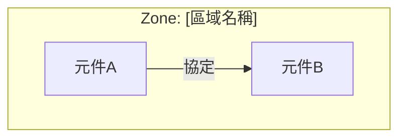

# 高階系統架構 — [專案名稱]

版本：v1.0
更新日期：YYYY-MM-DD

## 1. 系統邊界
[描述本系統與外部系統的邊界，哪些在範疇內、哪些在範疇外]

### 1.1 外部介面清單
| 介面 ID | 外部系統 | 介面類型 | 通訊協定 | 資料方向 | 備註 |
|---------|----------|----------|----------|----------|------|

## 2. 邏輯架構圖
[此處插入 Mermaid 架構圖]

### 2.1 元件說明
| 元件 | 功能描述 | 部署位置 | 對應 CBOM 品項 |
|------|----------|----------|----------------|

## 3. 網路拓撲 / Zone-Conduit
[此處插入網路架構 Mermaid 圖]

### 3.1 Zone 定義
| Zone | 安全等級(SL) | 包含元件 | 說明 |
|------|-------------|----------|------|

### 3.2 Conduit 定義
| Conduit | 連接 Zone | 通訊協定 | 安全措施 | 備註 |
|---------|-----------|----------|----------|------|

## 4. 資料流
### 4.1 主要資料流
| 流程名稱 | 來源 | 目的 | 資料類型 | 頻率 |
|----------|------|------|----------|------|

## 5. 關鍵技術選型
| 技術領域 | 選型 | 選型理由 | 替代方案 |
|----------|------|----------|----------|

## 6. 圖例
[說明圖中使用的符號、顏色、線型代表的意義]
